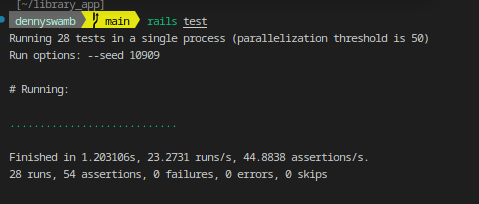

# Library App Documentation

## Overview
g

## Features
- User authentication (sign-up, login, logout)
- Browse available books
- Borrow books
- User profile management

## Technologies Used
- **Backend**: Ruby on Rails
- **Frontend Styling**: Tailwind CSS
- **Database**: PostgreSQL
- **Authentication**: Devise

## Installation
1. Clone the repository:
   ```sh
   git clone https://github.com/yourusername/library_app.git
   cd library_app
   ```
2. Install dependencies:
   ```sh
   bundle install
   yarn install
   ```
3. Set up the database:
   ```sh
   rails db:create db:migrate db:seed
   ```
4. Start the server:
   ```sh
   rails server
   ```

## API Routes

### Authentication
- `POST /signup` - Create a new user
- `POST /login` - Log in a user
- `DELETE /logout` - Log out the current user

### Books
- `GET /books` - Retrieve all books
- `GET /books/:id` - Retrieve a specific book

### Borrowings
- `POST /books/:book_id/borrowings` - Borrow a book
- `PATCH /borrowings/:id` - Update borrowing status

## Tailwind CSS Integration
Tailwind CSS is used for styling the frontend to ensure a modern and responsive UI. Components are designed using utility-first classes for better flexibility and customization.

To include the test results image and the demo video in your README file, you can use the following Markdown syntax. Assuming the image and video are located in the 

images

 directory, here is how you can update the README:

```markdown
# Library App Documentation

## Overview
Library App is a web application that allows users to browse books, borrow them, and manage their profiles. The app is built using Ruby on Rails and follows RESTful principles.

## Features
- User authentication (sign-up, login, logout)
- Browse available books
- Borrow books
- User profile management

## Technologies Used
- **Backend**: Ruby on Rails
- **Frontend Styling**: Tailwind CSS
- **Database**: PostgreSQL
- **Authentication**: Devise

## Installation
1. Clone the repository:
   ```sh
   git clone https://github.com/yourusername/library_app.git
   cd library_app
   ```
2. Install dependencies:
   ```sh
   bundle install
   yarn install
   ```
3. Set up the database:
   ```sh
   rails db:create db:migrate db:seed
   ```
4. Start the server:
   ```sh
   rails server
   ```

## API Routes

### Authentication
- `POST /signup` - Create a new user
- `POST /login` - Log in a user
- `DELETE /logout` - Log out the current user

### Books
- `GET /books` - Retrieve all books
- `GET /books/:id` - Retrieve a specific book

### Borrowings
- `POST /books/:book_id/borrowings` - Borrow a book
- `PATCH /borrowings/:id` - Update borrowing status

## Tailwind CSS Integration
Tailwind CSS is used for styling the frontend to ensure a modern and responsive UI. Components are designed using utility-first classes for better flexibility and customization.

## Tests


## Demo Video
[](app/assets/images/test1.mp4)

## Contributing
1. Fork the repository.
2. Create a feature branch.
3. Commit your changes.
4. Push to the branch and submit a pull request.

## License
This project is licensed under the MIT License.
